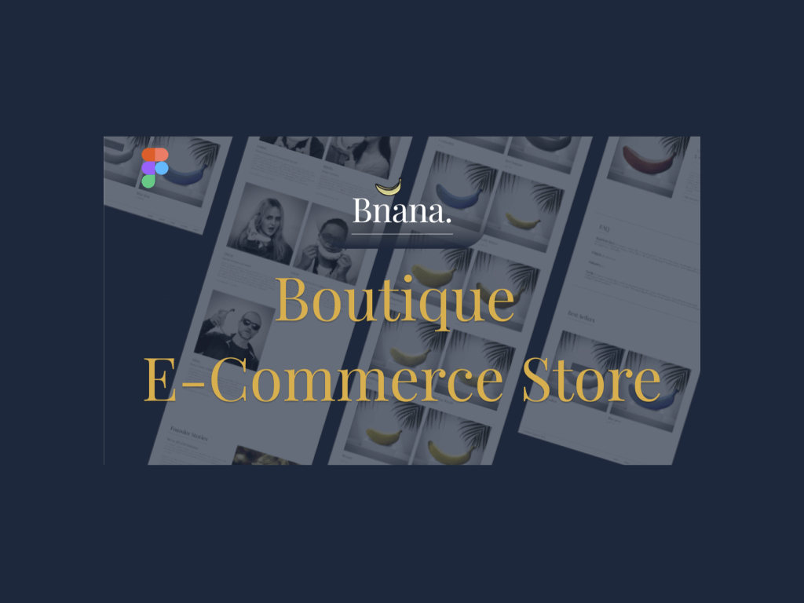
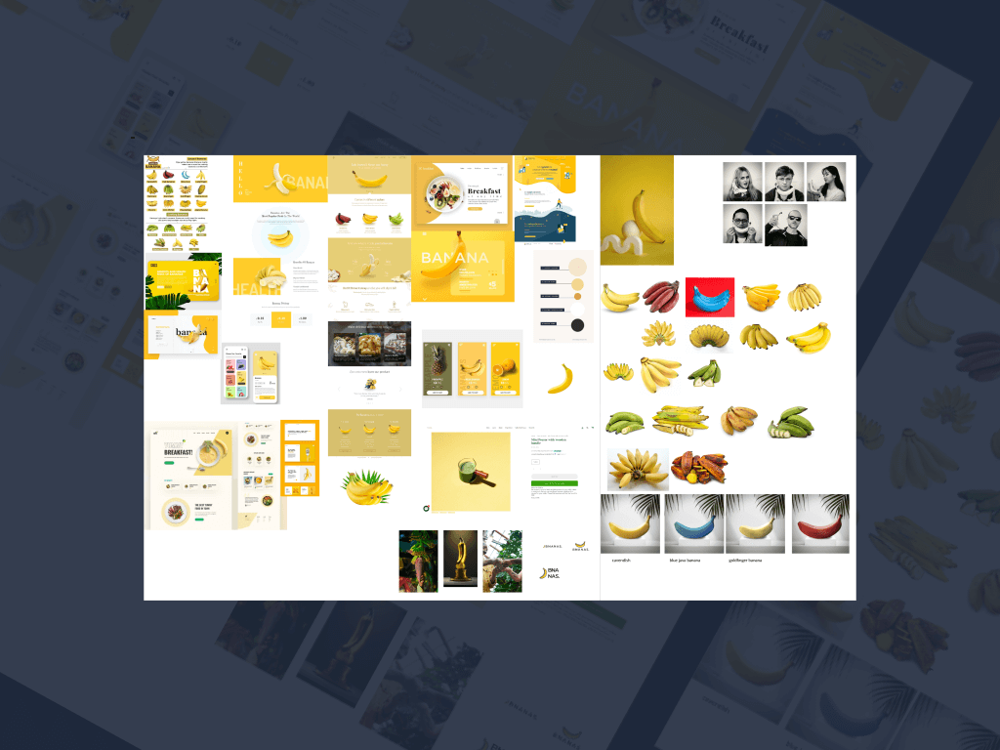
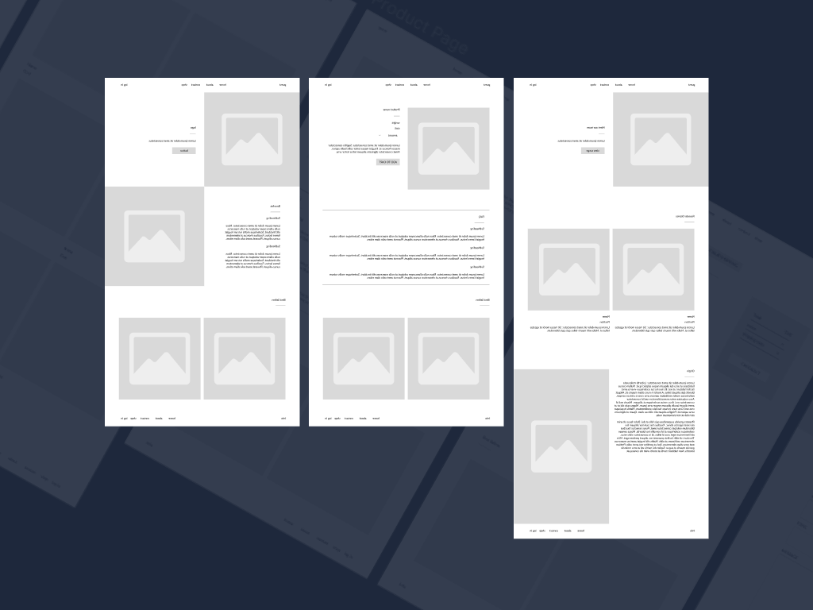
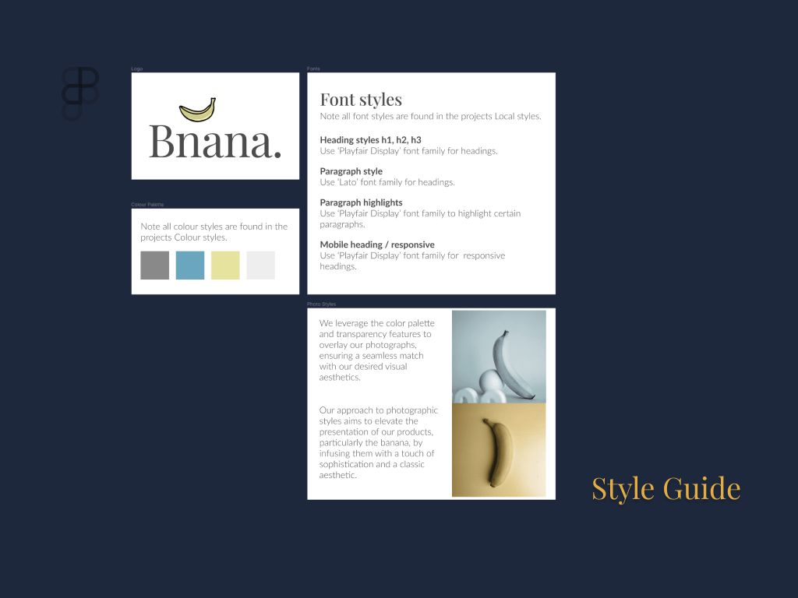
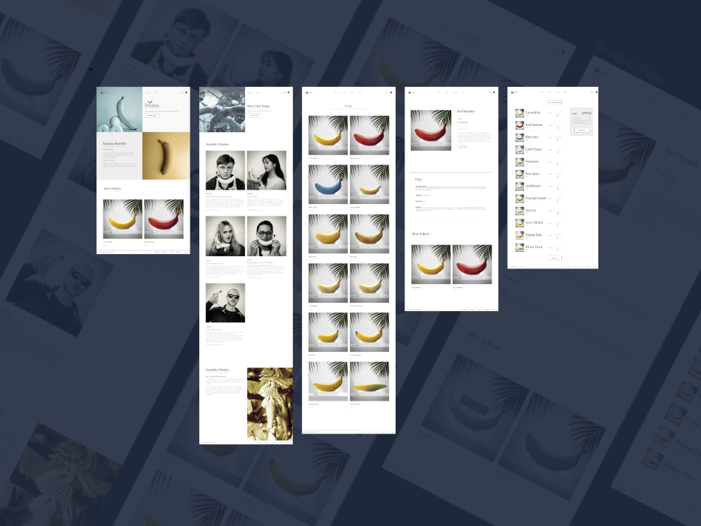
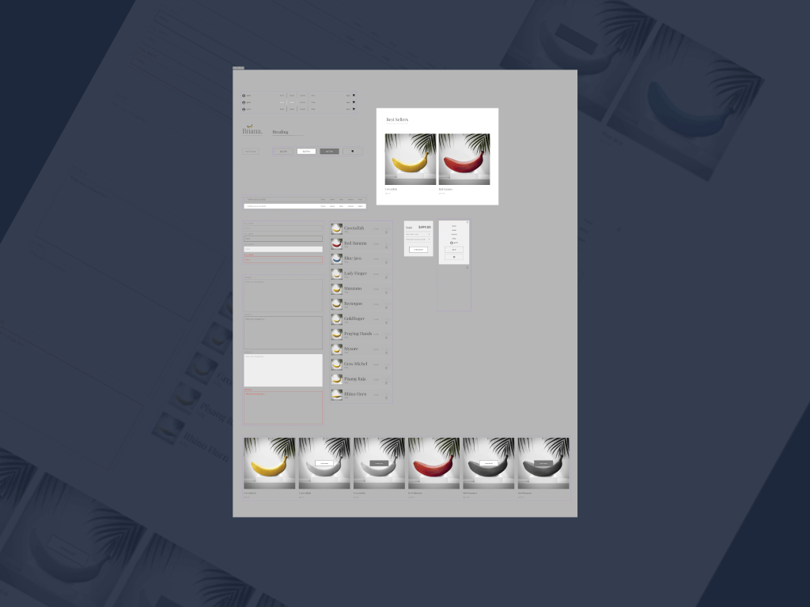
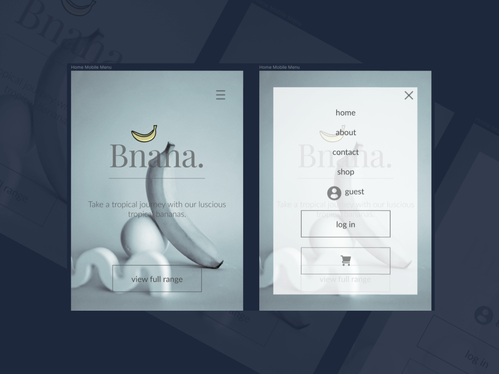
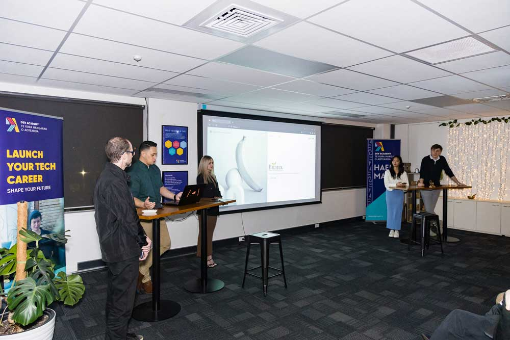

Join me in this blog post as I delve into the intricacies of the Dev Academy multi-day final project.

I'll be sharing insights into the dynamic processes, effective communication, collaborative efforts, and the essential human skills that played a pivotal role in bringing the Banana Multi-Day Project to fruition.

**Planning project and human skills application.** Our team, recognising the value of effective collaboration, took the time to contribute our individual strengths while supporting each other through the more challenging aspects.

Our approach involved creating a well-structured plan for the upcoming workdays. We emphasised not only the professional aspects of our collaboration but also dedicated time for check-ins — moments for meaningful work discussions, active listening, and fostering a sense of aroha (compassion) whenever possible.

## Wireframing, branding and front-end design.

Opting for the versatile tool Figma, we meticulously crafted wireframes and designs that would set the visual tone for our e-commerce venture. See the figma project here: 

#### [Bnanas Figma Project](https://www.figma.com/file/GEG5USzU64a4JDybEDEMsL/bnanas---E-Commerce-Web-Site?type=design&node-id=622%3A468&mode=design&t=zQczJDcQ2zDPFWOC-1)

In the realm of branding and color schemes, we debated a variety of ideas, ultimately embracing a more minimalistic approach. Our goal was to ensure the website's navigation was intuitive and the overall user experience was seamless.

### Unveiling our full-stack app

Embark on the triumphant culmination of our journey as we proudly unveil the fully realised front and back ends of our e-commerce application.

Having adeptly navigated the challenges, we found ourselves ahead of schedule. This fortuitous circumstance allowed us the luxury of refining every detail, addressing any lingering bugs, and polishing features that warranted additional attention.

As the day of presentation dawned, we recognised the significance of the moment. Our audience, a distinguished gathering of family, friends, and industry professionals, eagerly awaited a glimpse of our creation. Brimming with pride, we delivered a stellar presentation, seamlessly showcasing the app's capabilities.

The session became an interactive dialogue, with us fielding questions adeptly and demonstrating the app with finesse. It was a testament to the dedication and skill embodied in our work.

Join us in celebrating this milestone, where our full-stack app takes center stage, leaving a lasting impression on all who witnessed its debut.

#### Challenges and insights.

The project scope for this project had the potential to expand beyond the initial plan, leading to scope creep and potentially affecting timelines and resources. Establish a well-defined project scope at the outset and use project management tools (e.g., Trello) to track tasks and milestones. Regularly revisit and reassess the project scope with the team, and if there are proposed changes, evaluate their impact on timelines and resources before incorporating them.

Technical hurdles, such as unforeseen bugs, platform compatibility issues, or integration complexities, can disrupt the development process. Conduct thorough testing throughout the development process, including unit testing, integration testing. Encourage open communication within the team to identify and address technical challenges promptly. Having contingency plans and allocating time for unexpected issues in the project timeline can mitigate the impact of technical challenges.
