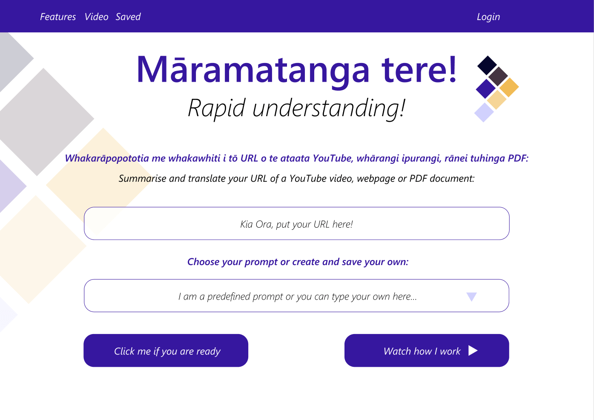
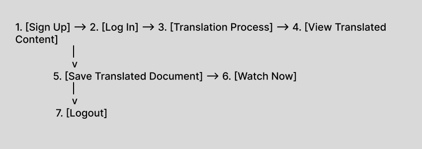
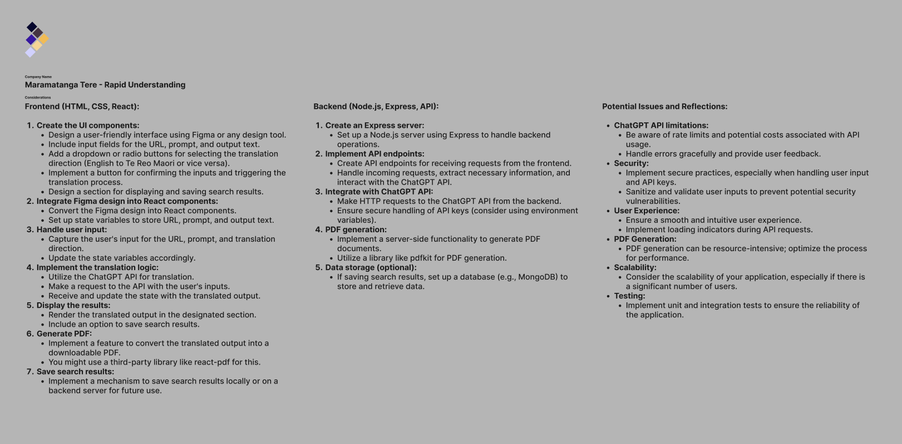
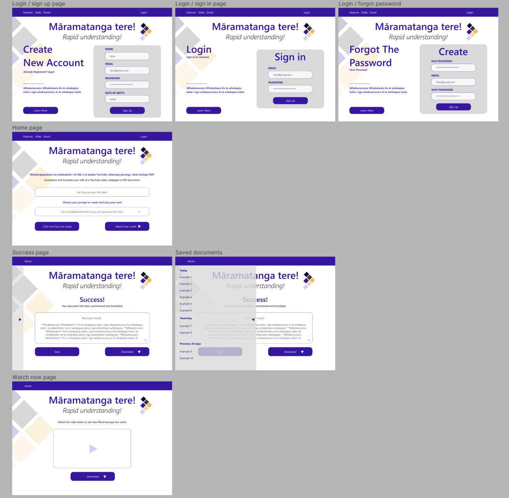

Join me in this blog post as I delve a personal project and the research and design done so far. 

#### For a in depth look into this process please see the figma project in the link: [Maramatanga Tere - Rapid Prototyping](https://www.figma.com/file/X5hMOkYsTjioparVlsMXtl/M-Tere---Brief-%26-Persona?type=design&node-id=135%3A1909&mode=design&t=Ko5gLeYfdyJ5wJgh-1)

**Planning and understanding.** The project's primary goal is to develop a user-friendly platform facilitating seamless translation of diverse content between English and Te Reo Maori. To achieve this, a thoughtful tech stack is selected, leveraging React for the frontend, Node.js and Express.js for the backend, MongoDB for flexible data storage, and the ChatGPT API for advanced language translation.

The project encompasses essential features, including user authentication, content translation, results display, and the ability to save translations. A phased approach, starting with the Minimum Viable Product (MVP), ensures a focused and iterative development process.

## Developing a persona and inspiration.

As I was working in the playground industry I was inspired by a conversation I had earlier in the year with a teacher who was struggling with watching a video online and could not make sense of the context of the video because of a language barrier. She happened to be from the same region of New Zealand I was from so I took this conversation to heart.

During this time I also took in other pain points in a similar vein from other teachers of many kinds and came to see that this maybe something to consider for application of some sort.

Due to this I felt it right to come up with a generic persona based of these conversations to help with the design process.

#### " Hine, a 32-year-old teacher from Kaitaia in the Far North of New Zealand, embodies the essence of cultural preservation and education. Passionate about promoting Te Reo Maori, Hine seeks a language translation tool that allows her to effortlessly convert English content, particularly educational materials, into Te Reo Maori. 

#### Struggling with a busy schedule, Hine values efficiency and accessibility, making her an ideal user for a tool that is intuitive and time-efficient. She envisions a translation tool that not only respects the cultural nuances of Te Reo Maori but also provides a seamless experience for saving and sharing translated content. 

#### As an educator, Hine's input and feedback contribute to the tool's ongoing improvement, making her a key stakeholder in the language preservation journey ".

## The task flow.

## Project considerations, potiential issues and Reflection to this point.

## Below is the beginnings of the UI and UX..

The Minimum Viable Product (MVP) for the language translation project would focus on delivering essential features that showcase the core functionality of the platform. Here's a breakdown of the MVP:

## User Authentication:

Sign-up and login functionality to allow users to create accounts and log into the platform securely.
Translation Feature:

Ability to input a URL (YouTube video, webpage) or upload a PDF for translation.
Translation from English to Te Reo Maori and vice versa using the ChatGPT API.
Results Display:

Clear display of translated content to the user after the translation process.
Save Translations:

Basic functionality to save translated documents for future reference.
User Feedback:

Simple feedback mechanism to collect user feedback on translations.
